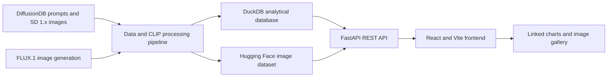

# Alignment Auditor

Alignment Auditor was developed by **Xiaoyu Zhong** and **`yhuan331`** as a team
project for ECS 273 at UC Davis.

## Description

Alignment Auditor is an interactive visual analytics tool for evaluating how well text-to-image generative models render the concepts described in their input prompts. The tool uses **CLIP scores** — a measure of semantic similarity between an image and its prompt — to quantify and compare alignment quality across two models: **Stable Diffusion 1.x (SD 1.x)** and **FLUX.1**. Prompts and the SD 1.x reference images are drawn from the [DiffusionDB](https://huggingface.co/datasets/poloclub/diffusiondb) dataset; the FLUX.1 images are generated from the same prompts so the two models can be compared head-to-head.

The tool is organized around four research questions:

- **RQ1** — What is the overall distribution of alignment scores across the dataset?
- **RQ2** — Which concept categories (e.g. nouns vs. adjectives, styles, artist references) are harder for models to render, and which specific concepts fail most often?
- **RQ3** — How does the CFG (Classifier-Free Guidance) scale parameter affect alignment in SD 1.x?
- **RQ4** — How do SD 1.x and FLUX.1 compare head-to-head on the same prompts?

The backend is a **FastAPI** server backed by a **DuckDB** database containing pre-computed CLIP scores and per-concept labels for ~3,000 SD 1.x images and ~2,700 FLUX.1 images. The frontend is a **React + Vite** single-page application with interactive, linked charts (histograms, box plots, scatter plots, heatmaps) and an image gallery, letting users drill down from aggregate trends all the way to individual images and their per-concept scores.

## Data

No data preparation is required to run the app.

- The pre-built database (`server/alignment_auditor.duckdb`) ships with the repository and contains all pre-computed CLIP scores and concept labels.
- The generated images are hosted on a **public Hugging Face dataset** — [`dontwakemeup/prompt-image-auditor`](https://huggingface.co/datasets/dontwakemeup/prompt-image-auditor) — and are loaded on demand at runtime via URLs stored in the database. **You do not need to download any images**; they stream directly from Hugging Face's CDN when the app runs.
- A backup archive of all images is also available in this [Google Drive folder](https://drive.google.com/drive/folders/1CivDBvpvf7Y0b8TSd4c7DWoPlfaopoel?usp=drive_link) in case the Hugging Face dataset is unavailable.

## Architecture



The processing pipeline computes image-level and per-concept CLIP scores. DuckDB
stores the analytical records, while generated images are hosted on Hugging Face.
FastAPI exposes filtered and aggregated results to the React application.

## Team Contributions

- **Xiaoyu Zhong** (Git identities: `calista` and `DontWakeMeUp`) — generated
  and prepared the image data; implemented CLIP-based image and concept scoring;
  designed the DuckDB database; built the FastAPI backend and API contract; and
  published generated images to Hugging Face for CDN-backed delivery.
- **`yhuan331`** — implemented the React/Vite frontend and its interactive,
  linked visualizations and image-gallery interactions.
- Both contributors collaborated on research questions, integration, debugging,
  and the final project presentation.

## Installation

### Prerequisites

- Python 3.10+
- Node.js 18+

### Backend

```bash
# From the project root
python -m venv .venv
source .venv/bin/activate      # Windows: .venv\Scripts\activate
pip install -r requirements.txt
```

To run the backend test suite:

```bash
pip install -r requirements-dev.txt
pytest
```

CI also audits `requirements.txt` for known vulnerabilities in both direct and
transitive production Python packages. This does not include the separate
frontend build-tool dependency tree or replace application security testing.

### Frontend

```bash
cd client
npm install
```

## Execution

The backend and frontend run in two separate terminals.

### 1. Start the backend

```bash
# From the project root (with .venv activated)
cd server
uvicorn server:app --reload --port 8000
```

The API will be available at `http://localhost:8000`.
Interactive API docs: `http://localhost:8000/docs`

### 2. Start the frontend

```bash
cd client
npm run dev
```

Open `http://localhost:5173` in your browser.

### 3. Run the demo

With both servers running, open `http://localhost:5173` and walk through the four tabs:

- **RQ1** — View the overall CLIP-score distribution as a histogram and read off summary statistics for each model.
- **RQ2** — Compare which concept categories score lowest, then click a category or concept to see the example images behind the numbers.
- **RQ3** — Inspect how the CFG guidance scale relates to alignment in SD 1.x.
- **RQ4** — Click any point in the SD-vs-FLUX scatter plot to open the two paired images side by side, along with each model's score for that prompt.

Charts are linked — selecting a point or category updates the image gallery so you can move from an aggregate trend down to the individual images driving it.

## Run the production container

The production image builds the React frontend in a Node stage, then copies only
the compiled assets into a non-root Python runtime that serves both the UI and API.

```bash
docker compose up --build
```

Open `http://localhost:8000`. The API documentation remains available at
`http://localhost:8000/docs`, and readiness is reported at
`http://localhost:8000/health/ready`.

Stop the service with:

```bash
docker compose down
```

See [`docs/architecture.md`](docs/architecture.md) for the deployment shape,
technical trade-offs, and measured production baseline.

### Optional environment variables

| Variable  | Default                             | Description                  |
| --------- | ----------------------------------- | ---------------------------- |
| `DB_PATH` | `server/alignment_auditor.duckdb`   | Path to the DuckDB database  |

## Repository structure

```
.
├── requirements.txt
├── requirements-dev.txt
├── tests/                            # backend API tests
├── server/
│   ├── server.py                    # FastAPI app + REST endpoints
│   └── alignment_auditor.duckdb     # pre-built database (CLIP scores + concepts)
└── client/                          # React + Vite frontend
    └── src/
```
