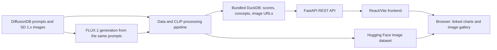

# Alignment Auditor

An interactive visual analytics app for checking how well text-to-image models
render the concepts in their prompts. Compare Stable Diffusion 1.x and FLUX.1
using precomputed CLIP scores, then drill down from aggregate charts to paired
images and per-concept results.

**[Open the live demo](https://alignment-auditor.onrender.com/)** ·
[Architecture and measurements](docs/architecture.md) ·
[API docs](https://alignment-auditor.onrender.com/docs)

The demo runs on a free Render instance and may take about a minute to wake
after inactivity.

## What you can explore

| View | Question | Interaction |
| --- | --- | --- |
| RQ1 | How are alignment scores distributed? | Compare model-level histograms and summary statistics. |
| RQ2 | Which concept categories are hardest to render? | Select a category or concept to inspect example images. |
| RQ3 | How does CFG guidance scale relate to SD 1.x alignment? | Explore the score-by-guidance visualizations. |
| RQ4 | How do the models compare on the same prompts? | Select a scatter-plot point to inspect paired images and scores. |

The analysis covers **3,000 SD 1.x images** and **2,699 FLUX.1 images**.
Prompts and SD 1.x reference images come from
[DiffusionDB](https://huggingface.co/datasets/poloclub/diffusiondb); FLUX.1
images were generated from the same prompts. CLIP similarity is a useful
comparison signal, not a complete measure of image quality or prompt fidelity.

## Engineering snapshot

| Evidence | Measured or verified result |
| --- | --- |
| Public deployment | React UI and FastAPI served from one Docker image on Render; `/health/ready` checks the bundled database. |
| CI | Backend lint/tests/coverage, frontend build, production image build and runtime smoke test, and Python dependency audit. |
| Tests | 44 backend tests passed; 99.42% statement coverage in the 2026-09-18 local verification. |
| Observability | Structured JSON request logs and safe API errors; a `/api/stats` request log was verified in Render Logs on 2026-09-18. |
| Public latency snapshot | On 2026-09-19, `/api/stats` p95 was 211.09 ms (100/100 successful); `/api/rq4/paired-scatter` p95 was 784.16 ms (50/50 successful), at concurrency 2. |

The latency figures are from one short, warmed-up, client-side run over the
public internet. They are **not** uptime, sustained-capacity, or cold-start
claims. See [methods, throughput, trade-offs, and local baselines](docs/architecture.md).

## Architecture


```mermaid
flowchart LR
    A["DiffusionDB prompts and SD 1.x images"] --> B["Data and CLIP processing pipeline"]
    A --> C["FLUX.1 generation from the same prompts"]
    C --> B
    B --> D["Bundled DuckDB: scores, concepts, image URLs"]
    B --> E["Hugging Face image dataset"]
    D --> F["FastAPI REST API"]
    F --> G["React/Vite frontend"]
    G --> H["Browser: linked charts and image gallery"]
    E --> H
```

The offline pipeline computes image-level and per-concept CLIP scores and
publishes image data. At runtime, the production Docker image serves the
React UI and FastAPI from one non-root Python service. FastAPI reads the bundled,
read-only DuckDB database; the browser loads images on demand from the
[public Hugging Face dataset](https://huggingface.co/datasets/dontwakemeup/prompt-image-auditor).
No dataset preparation or image download is required to run the app. The
[image archive backup](https://drive.google.com/drive/folders/1CivDBvpvf7Y0b8TSd4c7DWoPlfaopoel?usp=drive_link)
is available separately.

The single-container, bundled-database design keeps this read-only demo simple
to deploy, but data changes require a new image and external image delivery
depends on Hugging Face. See [architecture and trade-offs](docs/architecture.md)
for details.

## Contributions

Alignment Auditor began as a two-person ECS 273 project at UC Davis:

- **Xiaoyu Zhong** (`calista` / `DontWakeMeUp`) prepared the image data,
  implemented CLIP-based image and concept scoring, designed the DuckDB
  database, built the FastAPI backend and API contract, and published the
  generated images to Hugging Face. Xiaoyu later added the public deployment,
  container, CI, tests, logging, health checks, and benchmarks.
- **`yhuan331`** built the React/Vite frontend, linked visualizations, and
  image-gallery interactions.
- Both contributors collaborated on the research questions, integration,
  debugging, and course presentation.

## Run locally

The shortest path is the production-style container. With Docker Compose:

```bash
docker compose up --build
```

Open <http://localhost:8000>. API docs are at <http://localhost:8000/docs>;
readiness is at <http://localhost:8000/health/ready>. Stop with
`docker compose down`.

For separate backend/frontend development, use Python 3.10+ and Node.js 20+:

```bash
python -m venv .venv
source .venv/bin/activate       # Windows: .venv\Scripts\activate
pip install -r requirements-dev.txt
cd server
uvicorn server:app --reload --port 8000
```

In a second terminal:

```bash
cd client
npm ci
npm run dev
```

Open <http://localhost:5173>. The Vite development server proxies API requests
to port 8000. The prebuilt database is included at
`server/alignment_auditor.duckdb`.

## Verify and deploy

From the repository root, run backend tests and lint, then build the frontend:

```bash
python -m pytest --cov=server --cov-report=term-missing
ruff check server scripts tests
(cd client && npm ci && npm run build)
```

To reproduce a local API latency sample with the app running:

```bash
python scripts/benchmark_api.py --base-url http://localhost:8000 \
  --path /api/stats --requests 1000 --concurrency 5 --warmup 20
```

The benchmark reports successes, failures, p50/p95 latency, and throughput;
it exits nonzero on a measured failure. Run it only against a service you own.
The [architecture notes](docs/architecture.md) record the exact local and
public measurement methods.

[`render.yaml`](render.yaml) configures the public Docker service from `main`,
with automatic deployment after passing CI checks and a `/health/ready` probe.
It uses Render's free plan; check the
[current free-service limits](https://render.com/docs/free) before recreating
the service or enabling billable resources.
