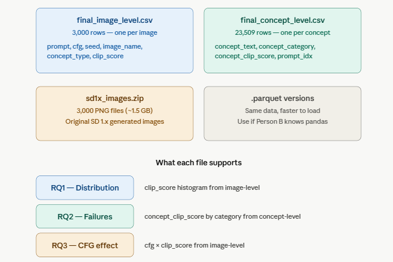

## image-level 文件（3000 行
是主表，每行一张图，clip_score 是整体 prompt-image 对齐分数（0-1，均值 0.31）。用这个做 RQ1 的 score 分布图和 RQ3 的 cfg × score 分析。

## concept-level 文件（23509 行）
是细粒度表，每个 prompt 被 spaCy 拆成多个 concepts（noun chunks + adjectives），每个 concept 有独立的 concept_clip_score。用这个做 RQ2 的 concept failure 分析 — adjective 平均 0.215，noun_chunk 平均 0.235，说明形容词类描述更容易被模型忽略。

## sd1x_images.zip 
是 3000 张原始图片，可视化展示用。 https://drive.google.com/drive/folders/1CivDBvpvf7Y0b8TSd4c7DWoPlfaopoel?usp=sharing [uploading]

